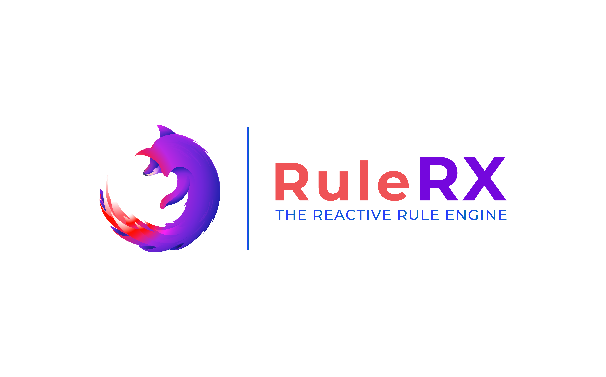

[](https://travis-ci.org/yuxblank/RuleRX)
[](https://coveralls.io/github/yuxblank/RuleRX?branch=master)

# RuleRx
A library for rule evaluation written in Typescript that enables the reactive 
approach (with Rx.js) on business objects.

## The Reactive RuleEngine library

The engine allow evaluating rules that are defined as object streams representing a 
scenario.
Rules configuration leverage JsonPath specification in order to allow traversing objects
nodes without requiring a predefined schema.

No predefined schema does not mean you can't have type-safety!  you can set the type
of any given context on which the rules will be evaluated.

Rules are evaluated among observables of the business context which produces an 
observable stream of emitted results whenever there's a match.

Context observables can emit new values over time, and the rules will be streamed any
time your business context changes.

## Features

- Schemaless object nodes traversal using JsonPath
- Support custom operators and embedded operators
- Support for serialized rules to be evaluated
- I/O as observable streams (Rx.js)
- Easy rule definition for business/functional approach
- Supported for both Node.js and the Browser

## Getting started

### Installing the library:
with npm:
```shell script
npm i rulerx
```

### Writing basic rule

First, let's define one model of our context.

```ts
class Person {name: string; surname: string }
```

Then lets defines our rule sets:

```ts
const rules: RuleSet<Person>[] = [
       {
         all: [ // match all these rules
           {
             fact: 'name is equal to Jhon', // describe the fact
             operator: equal, // the operator
             path: '$.name', // the jsonPath of the node
             value: 'Jhon' // the expected value
           },
           {
             fact: 'surname is equal to Doe',
             operator: equal,
             path: '$.surname',
             value: 'Doe'
           }
         ]
       }
     ]
```

Create some Persons observables for the context

```ts
const persona: Person = {
    name : "Jhon",
    surname: "Doe"
}
const persona2: Person = {
    name : "Ada",
    surname: "Lovelace"
}
const observable: Observable<Person> = of(persona);
const observable2: Observable<Person> = of(persona2);
```

Now it's time to evaluate our context!

```ts
new RuleRx<Person>()
      .evaluate(rules, observable, observable2)
      .pipe(mergeAll())
      .subscribe(next => {
            console.log(next.element);
      })
```

This will emit :
```
{
    name : "Jhon",
    surname: "Doe"
}
```


